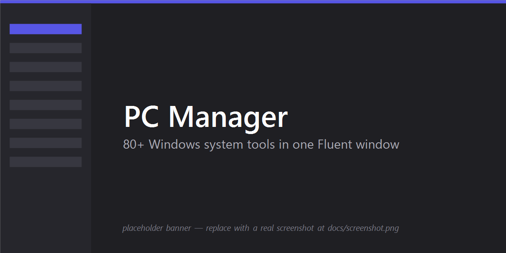

<div align="center">

# 🖥️ PC Manager

**A Windows desktop Swiss-army knife — 80+ system tools in one Fluent window.**

[](#-download)
[](#-download)
[](LICENSE)
[](#-whats-inside)
[](#-safety--privacy)

</div>

> *The Windows toolbox that should've come in the box.*

<p align="center">
  
</p>

PC Manager bundles hardware sensors, a disk cleaner, a debloater, driver/service managers, a real
on-demand virus scanner, network diagnostics, a local-LLM "AI analyst" and **a lot** more — each a
focused page you reach from the sidebar or a **`Ctrl+K` command palette**. It's the toolbox you'd
otherwise assemble from a dozen separate downloads, in one self-contained app that ships with **80+
tools and exactly zero toolbars, "PC optimizers," or "Your PC is at risk!" popups** — which already
makes it friendlier than half of what your machine came with.

> [!NOTE]
> This repository is the **download page**. The application source is maintained privately; everything
> you need to *run* PC Manager is here.

> [!IMPORTANT]
> PC Manager runs **as the invoking user** (not elevated). Privileged tools detect when they need
> administrator rights and offer a one-click restart-as-admin path. Many tools make **real changes**
> to your system — review actions before applying them. There is no cloud account and no telemetry.

## ✨ Highlights

The handful of things that set it apart from the usual "cleaner" apps:

- 🤖 **AI analyst** — point a **local** (Ollama / llama.cpp) or hosted (OpenAI / Anthropic / GitHub
  Models) model at your machine and ask *"why is my PC slow?"* in plain language. Your API key and
  prompts stay on your box; with a local model nothing leaves the PC at all.
- 🔌 **Live charger telemetry** — real-time charging **wattage, voltage, current**, energy delivered
  and time-to-full for laptops and USB-C PD — not just a battery percentage.
- 🦠 **Real virus scanner** — on-demand signature **+** heuristic scanning with a **quarantine vault**,
  an optional real-time watch, VirusTotal hash lookups, and a headless `--scan` mode for scripts.
- 📜 **Recipes** — declarative JSON "macros" that chain fixes (*close Discord → wipe its cache →
  restart it*) so a multi-step repair becomes one click.
- 📈 **Health timeline** — your machine's health score charted over time, so regressions are visible.
- 🧪 **Sysinternals launcher** — run Process Explorer, Autoruns, Procmon, TCPView and friends straight
  from `live.sysinternals.com`, no manual download.
- ⚖️ **Bottleneck calculator** — checks whether your CPU/GPU pairing is balanced for gaming or an upgrade.

## 🧰 What's inside

More than 80 tools across eight groups. Everything below is reachable from the sidebar **and** from
the `Ctrl+K` palette — type a name or a synonym (*"netstat", "bsod", "ram", "bloat"*) and jump straight
to it.

### 🏠 Overview
*Know your machine at a glance — specs, sensors, battery, and a health score that trends over time.*

| Tool | What it does |
|------|--------------|
| **Dashboard** | At-a-glance system summary and overall health score |
| **Tune up** | One-click, multi-step optimization pass (cache wipe, fixes, tweaks) with live per-step progress |
| **Modes** | Preset profiles (e.g. gaming / work / quiet) that flip a batch of settings at once |
| **PC Info** | Full system specs — CPU, RAM, board, Windows edition & build (with a copy button) |
| **Hardware** | Live CPU/GPU/RAM sensors, temperatures, fan & clock readouts; one-click PawnIO driver install to restore sensors blocked by Memory Integrity (HVCI) |
| **Bottleneck calculator** | Is your CPU/GPU pairing balanced for gaming / an upgrade? |
| **Battery health** | Laptop battery wear, design vs. full-charge capacity |
| **Charger** | Live charging wattage, voltage, current, energy delivered, time-to-full (USB-C PD) |
| **License** | Windows activation status, edition, and product key |
| **Display** | Brightness, refresh rate, scaling, night light, HDR per monitor |
| **Energy** | Battery / energy-efficiency report via `powercfg` |
| **Health timeline** | Health score trend charted over time |
| **AI analyst** | Local or hosted LLM that inspects the machine and answers questions in plain language |

### 📦 Apps
*Install, update, and — finally — uninstall, including the junk the OEM left behind.*

| Tool | What it does |
|------|--------------|
| **Apps installer** | Search and install software via `winget` from a curated catalog |
| **App updates** | List outdated apps and update them — including **one-click Update all** |
| **Uninstaller** | Remove installed programs |
| **Debloater** | Remove preinstalled bloatware (Xbox, Candy Crush, and friends) |
| **Startup apps** | Manage autostart entries that slow your boot |
| **Default apps** | File-type associations and default browser / PDF / image handlers |

### 💾 Storage
*Find what's eating the disk and reclaim it — safely.*

| Tool | What it does |
|------|--------------|
| **Cleaner** | Free space: `%TEMP%`, Windows Update cache, browser/thumbnail caches, crash dumps (no documents touched) |
| **Disk usage** | Treemap of what's actually taking space |
| **Large files** | Find the biggest files on a drive |
| **Duplicates** | Find duplicate copies by content |
| **Force delete** | Remove stuck / locked / in-use files and folders |
| **Game library** | Discover installed games (Steam, Epic, GOG, Xbox, Battle.net) and their on-disk sizes |
| **Disk benchmark** | Sequential & random read/write throughput (MB/s) and IOPS |
| **Partition management** | View partitions and volumes (read-only by design — no scripted `diskpart` wipes) |

### 🖥️ System
*The deep internals — drivers, services, processes, power, and the environment.*

| Tool | What it does |
|------|--------------|
| **Drivers** | List drivers, export the whole driver store before a reinstall (`pnputil`), DDU link for GPUs |
| **Faulty drivers** | Surface drivers reporting problems or errors |
| **Services** | Manage Windows services — with a confirmation prompt and a restore point before disabling |
| **Memory** | RAM usage and leak hunting |
| **Processes** | Task-manager-style process explorer |
| **Scheduled tasks** | Browse and manage Task Scheduler entries |
| **User accounts** | Local users, passwords, admin membership |
| **Bluetooth** | Paired Bluetooth devices |
| **Optional features** | Windows features (WSL, Hyper-V, Sandbox, …) |
| **Power plans** | Power schemes incl. Ultimate Performance (`powercfg`) |
| **Pen & touch** | Stylus / touch / palm-rejection and press-and-hold settings |
| **Process lineage** | Parent/child process tree — *who actually started this?* |
| **Stress tests** | CPU & RAM stability burn-in |
| **Audio devices** | Switch the default playback / recording device |
| **S.M.A.R.T. attributes** | Raw SMART health attributes for disks & SSDs |
| **WSL** | Manage WSL distros and `.wslconfig` memory/CPU caps |
| **PATH editor** | Edit, de-duplicate, and reorder the system & user `PATH` |
| **Driver Store cleanup** | Remove superseded OEM driver packages to reclaim space (`pnputil`) |

### 🌐 Network
*See what's talking to the internet, fix it when it breaks, and lock it down.*

| Tool | What it does |
|------|--------------|
| **Wi-Fi profiles** | Saved networks and their passwords |
| **Speed test** | Internet download/upload bandwidth |
| **TCP connections** | Listening ports and live connections (a friendlier `netstat`) |
| **Network usage** | Per-process bandwidth monitor |
| **Hosts file** | Edit the `hosts` file to block or redirect domains |
| **Network reset** | Flush DNS, reset Winsock, repair broken connectivity |
| **Firewall rules** | View, allow, and block inbound/outbound rules |
| **Wi-Fi analyzer** | Nearby networks — signal, channel, band, BSSID |
| **DNS-over-HTTPS** | Configure encrypted DNS (Cloudflare, Quad9, Google, AdGuard) |
| **Packet capture** | Capture traffic with `pktmon` to an `.etl` trace |

### 🛡️ Security
*Scan, quarantine, audit permissions, and check your encryption.*

| Tool | What it does |
|------|--------------|
| **Defender** | Windows Defender status and scans |
| **Virus scan** | On-demand signature + heuristic scanner with quarantine and an optional real-time watch |
| **Quarantine** | Manage isolated threats — restore or permanently delete |
| **File hash** | Compute / verify SHA-256 & MD5; optional VirusTotal lookups |
| **Privacy auditor** | Which apps have used the mic, camera, or location (capability consent) |
| **TPM & BitLocker** | TPM status, BitLocker encryption state, recovery key |
| **Browser extensions** | Audit Chrome / Edge / Firefox extensions and their permissions |
| **Group Policy** | Local policy & security policy — including Home edition (via LGPO / `secedit`) |

### 🔧 Maintenance
*Quick toggles, a fix-it library, and an undo button for your whole system.*

| Tool | What it does |
|------|--------------|
| **Quick Settings** | Common Windows toggles gathered in one place |
| **Right-click menu** | Manage shell context-menu entries |
| **Clipboard history** | Browse clipboard history |
| **Fixes (Fix-it library)** | Searchable library of fixes for common symptoms |
| **Restore points** | Create, list, and roll back to System Restore points |
| **Change history** | Snapshots of previous state for rollback |
| **Recent changes** | Timeline of installs, uninstalls, updates, and hotfixes |
| **Notification log** | History of toasts / Action Center notifications |
| **State backup** | Export / import PC Manager settings, hosts, and presets — migrate between machines |
| **Recipes** | Declarative JSON macros that chain multi-step fixes |
| **Settings** | App preferences — Field Mode, the restore-point safety net, scheduled maintenance, theme |

### 🩺 Diagnostics
*When something went wrong, find out exactly what — and when.*

| Tool | What it does |
|------|--------------|
| **Boot time** | Boot / startup duration analysis (ETW / TraceEvent) |
| **Reliability** | Windows stability index and crash history |
| **Event Viewer** | Windows event logs (requires admin) |
| **Crash analyzer** | BSOD / minidump bug-check analysis |
| **Wake from sleep** | What woke the PC — last-wake source and wake timers |
| **Memory diagnostic** | Schedule the Windows Memory Diagnostic / point you at memtest |
| **Sysinternals** | Launch Process Explorer, Autoruns, Procmon, TCPView, etc. live from Microsoft |

## 🛟 Safety & privacy

- 🧯 **Restore-point safety net** — before risky, hard-to-undo actions (debloat removal, disabling a
  service) PC Manager snapshots a System Restore point. On by default; best-effort — it's skipped
  silently when System Protection is off or you aren't running as admin (toggle in Settings).
- ✅ **Confirmations** on destructive actions, with a louder warning for system-critical services and a
  deliberately **read-only** partition tool (no scripted `diskpart` that could wipe a disk by accident).
- 🔒 **Field Mode** — one toggle that blocks **every** feature that would reach the internet (VirusTotal
  lookups, update checks, the PawnIO driver download, the AI analyst, and live Sysinternals pulls).
  Built for working on a client's or locked-down machine where outbound traffic shouldn't leak.
- 🏠 **Local-first, no telemetry** — settings and logs live under `%LocalAppData%\PCManager`; nothing
  is sent anywhere. Crash recovery is local too: if the app closes unexpectedly, the next launch just
  points you at the logs. No accounts, no analytics, no phone-home. *(We don't even know you're
  reading this. Hi, though. 👋)*

## 🚧 Status & known limitations

PC Manager is feature-complete and shipping, but a few things are deliberately deferred:

- ✍️ **The installer is unsigned.** Without an Authenticode code-signing certificate, the setup `.exe`
  trips SmartScreen's "unknown publisher" warning on first run — click *More info → Run anyway*. It'll
  be signed in a future release once a certificate is in place.
- 🛡️ **Restart-as-admin for privileged tools.** Tools that need elevation currently restart the whole
  app as administrator; finer-grained elevation (per-operation) is planned.
- 🔄 **Updates are notify-and-link, not auto-install.** *Settings → check for updates* compares your
  version to the latest release here and links the download; it doesn't silently self-update.

## ⬇️ Download

From the [**Releases**](../../releases/latest) page, pick whichever you prefer:

- 📥 **Installer** — `PCManager-Setup-x.y.z.exe`. Start-menu shortcuts, an uninstaller, and an optional
  run-at-startup task.
- 🎒 **Portable ZIP** — `PCManager-x.y.z-win-x64-portable.zip`. Unzip anywhere and run
  `PCManager\PCManager.App.exe`; nothing is installed and nothing is written to Program Files.

Both are **self-contained (win-x64)** — you don't need the .NET runtime installed — and trimmed of
debug symbols. **Requirements: Windows 10 / 11 (x64).** Each download ships a matching `.sha256` if
you want to verify it:

```powershell
(Get-FileHash .\PCManager-Setup-1.0.0.exe -Algorithm SHA256).Hash
```

## 🚀 Launch options

| Argument | Effect |
|----------|--------|
| *(none)* | Normal window |
| `--tray` | Start hidden in the system tray |
| `--maintenance` | Headless tune-up pass, then exit (used by the scheduled maintenance task) |
| `--scan [path]` | Headless virus scan (quick scan, or a file/folder); exit code `0` clean, `2` threats, `1` error |

A second normal launch signals the running instance to show its window and exits (single instance).
Closing the window hides to the tray by default; quit for real from the tray menu.

## 🐛 Found a bug?

Open it on the [**issue tracker**](../../issues) — bug reports and feature ideas are both welcome. A
good report gets fixed faster, so please include:

- **What happened vs. what you expected**, and the exact **tool / page** involved.
- Whether you were running **as administrator** — a lot of tools behave differently when elevated.
- Your **Windows edition & build** — the **PC Info** page has a copy button.
- The relevant tail of the log at **`%LocalAppData%\PCManager\logs`** (nothing leaves your PC unless
  you paste it).
- A **screenshot or GIF** if it's a UI glitch.

> ⚠️ **Security issue?** Please don't open a *public* issue for anything exploitable — report it
> privately first so it can be fixed before it's disclosed.

## 📄 License

[MIT](LICENSE) © U_L_T_I_M_A_T_E. PC Manager bundles third-party components under their own
licenses — see [`THIRD-PARTY-NOTICES.md`](THIRD-PARTY-NOTICES.md). A copy of both ships inside every
download.
